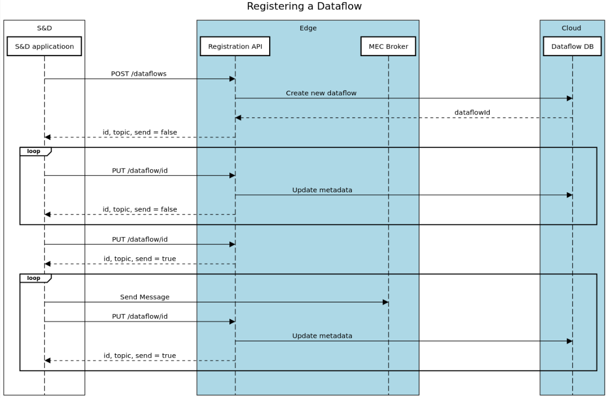

# Registration APIs

This project contains all the components needed to implement the Registration API, a Flask webserver running on the Edge, providing REST APIs to interact with a dataflow database.

## Interactions

The registration apis interract with:
- the Cloud Dataflow DB, to add informations about the active dataflows;
- the S&D application, retrieving from POST request the information about new dataflows;
- the S&D application, retrieving from PUT requests the dataflows keepalives.

  
## API Description

The yaml description of the APIs is provided in the [api](https://github.com/5gmeta/registration/tree/main/api) folder.   
The provided endpoints are:

- **POST /dataflows**, that receives the dataflow metadata as body in the request, adds the new dataflow to the DB and returns a JSON; this JSON contains:
    - the dataflowId;
    - the amqp topic where to send the messages;
    - a boolean value called "send", if "send" is True, at least one consumer in the 5GMETA platform is interested in the dataflow registered.
- **PUT /dataflows/\<dataflowId\>**, that receives the dataflow metadata as body in the request and performs several operations:
    - modifies the metadata associated to a specific dataflow; 
    - functions as a keepalive, if the sender does not send this PUT periodically (every 30/60 seconds), 5GMETA will delete the dataflow; 
    - generates the same response as the POST /dataflow, but may update the "send" value if the consumers change.
- **DELETE /dataflows/\<dataflowId\>**, that deletes a specific dataflow.

## Authors

* Federico Princiotto ([federico.princiotto@linksfoundation.com](mailto:federico.princiotto@linksfoundation.com))

## License

Copyright : Copyright 2022 LINKS

License : EUPL 1.2 ([https://eupl.eu/1.2/en/](https://eupl.eu/1.2/en/))

The European Union Public Licence (EUPL) is a copyleft free/open source software license created on the initiative of and approved by the European Commission in 23 official languages of the European Union.

Licensed under the EUPL License, Version 1.2 (the "License"); you may not use this file except in compliance with the License. You may obtain a copy of the License at [https://eupl.eu/1.2/en/](https://eupl.eu/1.2/en/)

Unless required by applicable law or agreed to in writing, software distributed under the License is distributed on an "AS IS" BASIS, WITHOUT WARRANTIES OR CONDITIONS OF ANY KIND, either express or implied. See the License for the specific language governing permissions and limitations under the License.